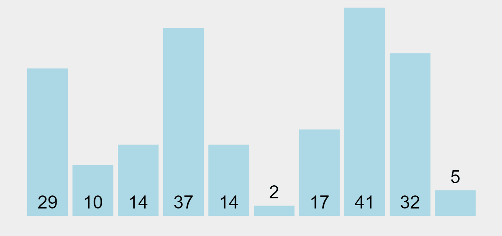

# Sorting Algorithms

Sorting algorithms are used for rearranging items in an array or a list. Selection Sort, Bubble Sort, Insertion Sort, Merge Sort, Quick Sort, Heap Sort, Counting Sort, Radix Sort are popular sorting algorithms.

In this repository above sorting algorithms have been implemented using python.

## 1. Bubble Sort

Bubble sort is a simple sorting algorithm that repeatedly swaps adjacent elements if the first element is greater than the second one from the beginning to the end of the list until it is sorted. 

Time comlexity
* Best Case - Ω(n)
* Avarage Case - θ(n2)
* Worst Case - O(n2)

